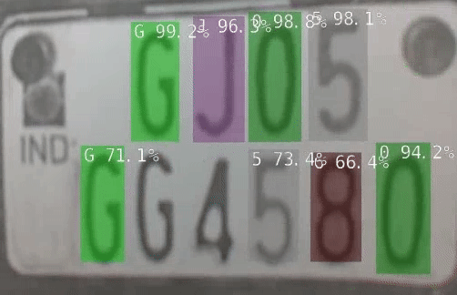
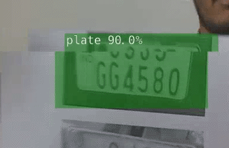

# Real-Time Indian License Plate Recognition with Jetson Nano
## _For Indian License Plates_

This repository is of a project named real-time indian license plate detection and recognition system. The source code of the repository implemented on Jetson Nano reached 40 FPS.

<div align='center'>
  
</div>

The license plate data set for this repository was collected in India. 

### Table of Contents

- [Real-time Indian License Plate Recognition with Jetson Nano](#real-time-auto-license-plate-recognition-with-jetson-nano)
  - [Table of Contents](#table-of-contents)
  - [Pipeline](#pipeline)
  - [Trained Models](#trained-models)
  - [Reference](#reference)

## Pipeline

This project is developed based on the pipeline described below. From a set of data collected in practice to the problem you want to solve. For details in this project, we will use the dataset of Indian license plates.

<div align='center'>
  
</div>

First, you need to prepare a labeled dataset. Then train the object detection model with the GPU on [Google Colab](https://colab.research.google.com/ "Google Colab") or your computer. Depending on the Deeplearning Framework you use, it will output the model file in different formats. With ONNX you can convert most of the above formats to a single `.onnx` format. Then with [TensorRT](https://developer.nvidia.com/tensorrt "TensorRT") installed on the [Jetpack Jetson Nano](https://developer.nvidia.com/embedded/jetpack "Jetpack"), you can run the object detection algorithms with high accuracy and FPS.


## Indian Plate Dataset
The project uses data for the indian license plate identification:

* [Indian Plate Dataset](https://www.kaggle.com/datasets/chiraggodaw/license-plate-dataset-resized)
      
## License Plate Detection

License Plate Detection results with `40 FPS` on Jetson Nano:

<div align='center'>
  
</div>

## Command
```sh
python3 detectnet-camera.py --model=./networks/indian_plate/indian_plate_ssd_v1.onnx --class_labels=./networks/indian_plate/labels.txt --input_blob=input_0 --output_cvg=scores --output_bbox=boxes --camera=csi://0 --width=640  --height=480
```

## License Plate Recognition

License Plate Recognition results with `40 FPS` on Jetson Nano:

<div align='center'>
  
</div>

## Command
```sh
python3 detectnet-camera.py --model=./networks/indian_plate_ocr/indian_plate_ocr_ssd_v1.onnx --class_labels=./networks/indian_plate_ocr/labels.txt --input_blob=input_0 --output_cvg=scores --output_bbox=boxes --camera=csi://0 --width=640  --height=480


```

The project uses data for the indian license plate identification:

## Trained Models

 **1. License Plate Detection:**

|Network         |FPS |num_class|Model| 
|----------------|----|---------|-----|
|SSD-Mobilenet-v1|40  |1        |[link](https://drive.google.com/file/d/1eBO1UzZkp4pa5b966Un1oBwccdtt5ID_/view?usp=sharing)|
|YoloV4          |None|1        |[link](https://drive.google.com/file/d/1eG0ccO0HvberUiesS380zQNTJM3eHn_m/view?usp=sharing)|
|YoloV4-tiny     |None|1        |[link](https://drive.google.com/file/d/1ZLno2-e7yXnJs0wo9tVXq7bvqT-9Jawm/view?usp=sharing)|
|Wpod            |10  |1        |[link](https://drive.google.com/file/d/1pUHHPu31QQittRnKIXRmhAe1j-diCv1N/view?usp=sharing)|

**2. License Plate Recognition:**

|Network         |FPS |num_class|Model| 
|----------------|----|---------|-----|
|SSD-Mobilenet-v1|40  |36       |[link](https://drive.google.com/file/d/1wTTWONFUXRBtSKA-Cq3snL21KXCB80PS/view?usp=sharing)|
|SVM             |None|36       |[link](https://drive.google.com/file/d/1rmQi7NwKAeunvmB8dF_SUi2JVEmRop4g/view?usp=sharing)|

## Reference

```
[1] https://github.com/dusty-nv/jetson-inference
[2] Liu, Wei, et al. "Ssd: Single shot multibox detector." European conference on computer vision. Springer, Cham, 2016.
[3] Howard, Andrew G., et al. "Mobilenets: Efficient convolutional neural networks for mobile vision applications." arXiv preprint arXiv:1704.04861 (2017).
[4] Bochkovskiy, Alexey, Chien-Yao Wang, and Hong-Yuan Mark Liao. "YOLOv4: Optimal Speed and Accuracy of Object Detection." arXiv preprint arXiv:2004.10934 (2020).
```
